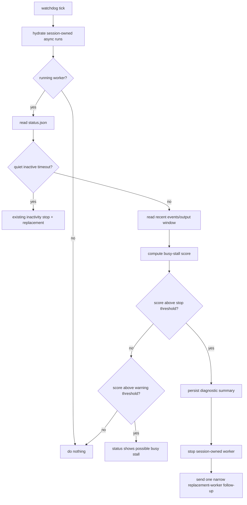

# fix: Detect and recover stalled async Goal-Driven workers

## Overview

Improve `pi-goal-driven`'s supervision of `pi-subagents` async workers so a worker that is technically still running but making no useful progress is surfaced, stopped, and replaced with a narrower recovery task. The immediate motivating case is an async worker that stayed active for 77+ minutes, repeatedly ran tiny `git show ... | grep ...` commands with `exit: 0`, and never produced a final report or verifiable fix.

The current inactivity watchdog only catches quiet workers. This plan adds a second layer for "busy but stuck" workers: detect repetitive low-progress activity from async status/events/output, preserve the diagnostic trail, and drive the master toward bounded recovery instead of waiting indefinitely.

---

## Problem Frame

The current runtime has a solid baseline: `/goal-driven:work` forces worker subagents into async mode, tracks session-owned async IDs, filters status to the current Goal-Driven session tree, and has an inactivity watchdog. However, the observed failure mode is not inactivity. The worker kept producing output, so `outputFile` and `events.jsonl` activity stayed fresh while the task was effectively spinning.

A better supervisor should distinguish three states:

1. **Healthy progress** — new evidence, file changes, test results, or completion summaries are appearing.
2. **Quiet stall** — no output/status heartbeat for a configured interval.
3. **Busy stall** — repeated low-information tool calls or identical command patterns continue for a long interval without terminal result, artifact, or verifiable workspace progress.

This plan targets state 3 while preserving existing behavior for healthy and quiet workers.

---

## Requirements Trace

- R1. Detect async workers that are still `running` but appear stuck in repetitive command/tool loops.
- R2. Preserve enough evidence from the stuck worker before stopping it: async ID, PID, status, recent output/events, cwd, elapsed time, and stop reason.
- R3. Stop only workers owned by the active Goal-Driven session tree; never kill unrelated global async work.
- R4. After stopping a stalled worker, request exactly one replacement worker with a narrower, recovery-oriented task.
- R5. Make the user-facing status clearly distinguish healthy activity, quiet inactivity, and busy-stall detection.
- R6. Keep the package thin and delegate low-level async execution to `pi-subagents`; do not embed a second subagent runtime.
- R7. Cover the detection and stop/replacement behavior with deterministic unit tests.
- R8. Prevent infinite auto-recovery loops by capping consecutive busy-stall replacements and escalating to user/master attention when the cap is reached.

---

## Scope Boundaries

- Do not modify `pi-subagents` internals in this plan unless later implementation proves a blocker. The first implementation should live in `pi-goal-driven` and consume the existing `status.json`, `events.jsonl`, and output logs exposed by `pi-subagents`.
- Do not add multi-worker concurrency to Goal-Driven; the single active worker invariant remains.
- Do not try to prove semantic task completion from worker text. The master still verifies criteria after worker completion.
- Do not auto-merge or trust worker-created changes. The master remains responsible for verification.
- Do not introduce a heavyweight database or daemon; use existing session entries and async run files.

### Deferred to Follow-Up Work

- Upstream `pi-subagents` enhancement: native configurable hard timeouts or richer `stalled` state in `status.json` can be proposed after the Goal-Driven-side detector proves useful.
- Optional UI polish: richer async widget labels for `busy-stall` vs `needs_attention` can be handled in a separate `pi-subagents` change.

---

## Context & Research

### Relevant Code and Patterns

- `index.ts` already tracks active runs with `ActiveRun`, `knownAsyncRuns`, `activeAsyncId`, `activeAsyncDir`, and session-scoped cleanup.
- `index.ts` has `ensureWatchdog`, `watchdogTick`, `getAsyncRunHeartbeatAt`, `stopKnownAsyncRuns`, and `sendGoalDrivenFollowUp` patterns for detecting quiet inactivity and requesting a replacement worker.
- `index.ts` intercepts `subagent_status list` and formats session-scoped active runs through `listSessionScopedActiveAsyncRuns` and `formatScopedSubagentStatusList`.
- `index.test.ts` already tests session scoping, prompt contracts, cleanup summaries, and status formatting with plain `node:test`.
- `README.md` documents the intended behavior: async worker launch, session-tree scoped status, master verification after completion, and inactivity watchdog.
- `pi-subagents` writes durable async files under the async run directory:
  - `status.json` includes `state`, `lastUpdate`, `pid`, `cwd`, `currentStep`, `steps`, `outputFile`, `lastActivityAt`, and activity metadata.
  - `events.jsonl` records child stdout/stderr and tool lifecycle events.
  - `output-<n>.log` contains streamed child output.
- `pi-subagents` already has a `needs_attention` control signal for no observed activity, but the observed issue is a repeated-output loop, not a no-output state.

### Institutional Learnings

- No `docs/solutions/` directory exists in this repository, so there are no local institutional learnings to carry forward.

### External References

- Pi extension docs confirm `tool_call`, `tool_result`, `message_end`, `session_start`, `session_shutdown`, `pi.sendMessage`, and `pi.appendEntry` are appropriate extension-level hooks.
- Pi SDK/docs confirm session-bound objects become stale after session replacement, so any recovery workflow should use plain IDs/paths and current `latestCtx`, not captured stale contexts.
- `pi-subagents` README confirms async status files are a supported surface: durable `status.json`, `events.jsonl`, markdown logs, and async status inspection are part of the public package behavior.

---

## Key Technical Decisions

- **Add a busy-stall detector alongside the existing inactivity watchdog:** The current watchdog is correct for quiet stalls. A separate detector avoids weakening that simple path and lets thresholds differ.
- **Use async run files as the source of truth:** `pi-goal-driven` already has `asyncDir`; reading `status.json`, `events.jsonl`, and output logs keeps the package thin and avoids duplicating `pi-subagents` runtime behavior.
- **Score repeated low-information activity instead of using wall-clock duration alone:** A long-running worker can be legitimate. The stop decision should require repeated command/tool signatures or output lines over a sustained window with no completion or meaningful status transition.
- **Persist a diagnostic summary before stopping:** When a worker is killed, the next worker and user need evidence. The summary should be appended to the session as a custom entry and included in the follow-up replacement prompt.
- **Replacement prompt should narrow scope:** The replacement worker should not resume the broad original task blindly. It should use the preserved evidence and focus on the smallest next verification or fix path.
- **Keep manual intervention available:** Auto-stop is useful, but status output should also give enough evidence for the user/master to interrupt intentionally when the detector is below the stop threshold.

---

## Open Questions

### Resolved During Planning

- **Is this a quiet inactivity problem?** No. The provided `ps` output and log summary show a running process with repetitive successful commands, so the fix needs busy-stall detection.
- **Should this live in `pi-goal-driven` or `pi-subagents` first?** First pass should live in `pi-goal-driven` because the package already owns Goal-Driven retry semantics and replacement task wording.
- **Should unrelated async runs be affected?** No. Existing session-tree scoping must remain the boundary for all stop/replace actions.

### Deferred to Implementation

- **Exact thresholds for repetition and duration:** Start with conservative constants and tune during implementation using tests and observed logs. Threshold naming and values are implementation details.
- **Exact event parsing shape:** `events.jsonl` records several event variants; implementation should parse defensively and extract only stable fields such as event `type`, `toolName`, `args`, and child stdout/stderr lines.
- **Whether file-change checks are needed in v1:** The first version can detect repeated tool/output patterns. Git/file-change-aware progress can be added only if tests or real examples show too many false positives.

---

## High-Level Technical Design

> *This illustrates the intended approach and is directional guidance for review, not implementation specification. The implementing agent should treat it as context, not code to reproduce.*

---

## Implementation Units

- [x] U1. **Extract async run inspection helpers**

**Goal:** Centralize reading and summarizing async run status, events, and output logs so both existing inactivity checks and new busy-stall checks use one small inspection surface.

**Requirements:** R1, R2, R3, R7

**Dependencies:** None

**Files:**
- Modify: `index.ts`
- Test: `index.test.ts`

**Approach:**
- Keep helpers local to `index.ts` unless implementation makes extraction clearly necessary.
- Reuse existing `readAsyncRunSnapshot`, `readPathMtime`, and `getAsyncRunHeartbeatAt` behavior instead of replacing it wholesale.
- Add a bounded reader for the tail of `events.jsonl` and the current `outputFile`; avoid reading unbounded large logs.
- Represent inspection output as plain data: async ID, async dir, state, pid, cwd, elapsed/last activity timestamps, recent tool signatures, repeated line signatures, and sample evidence.
- Preserve repo-relative testing style in `index.test.ts`; tests can create temporary async directories and write small status/event/output files.

**Execution note:** `index.ts` is over 300 LOC. If implementation turns into a structural refactor, do a small cleanup/extraction pass first and verify it separately before changing behavior.

**Patterns to follow:**
- `readAsyncRunSnapshot` and `readScopedAsyncRunStatus` for defensive JSON reads.
- `formatScopedSubagentStatusList` for concise user-facing summaries.
- Existing `node:test` table-style assertions in `index.test.ts`.

**Test scenarios:**
- Happy path: a valid `status.json` with `running` state and an `events.jsonl` containing recent tool events returns a bounded inspection summary with PID, state, cwd, and tool signatures.
- Edge case: missing `events.jsonl` or `outputFile` returns an inspection summary without throwing.
- Edge case: malformed JSON lines in `events.jsonl` are ignored while valid later lines are still parsed.
- Edge case: large output log is tailed rather than read fully; only recent evidence is included.

**Verification:**
- Existing watchdog tests still pass.
- New helper tests prove inspection is deterministic and safe against missing/malformed async artifacts.

---

- [x] U2. **Add busy-stall classification**

**Goal:** Detect workers that keep producing repetitive low-progress activity, such as repeated identical shell commands or repeated `exit: 0` output, without relying on quiet inactivity.

**Requirements:** R1, R5, R7

**Dependencies:** U1

**Files:**
- Modify: `index.ts`
- Test: `index.test.ts`

**Approach:**
- Add a classifier with at least three outcomes: `healthy`, `possible-busy-stall`, and `busy-stall`.
- Base the first version on conservative signals:
  - repeated identical or near-identical command/tool signatures in the recent event window;
  - repeated output-only success markers such as many `exit: 0` lines without completion events;
  - elapsed running time beyond a minimum age so short legitimate loops are not stopped;
  - absence of terminal state in `status.json`.
- Do not classify as a busy stall solely because a worker is long-running.
- Keep thresholds named constants so later tuning is straightforward.
- Avoid model/content-specific heuristics where possible; focus on tool/event repetition and lack of state transitions.

**Patterns to follow:**
- `deriveActivityState` in `pi-subagents` shows a simple state derivation pattern; mirror the idea locally without importing private internals.
- Existing watchdog constants `WATCHDOG_POLL_MS` and `WATCHDOG_INACTIVE_TIMEOUT_MS` show how runtime thresholds are currently represented.

**Test scenarios:**
- Happy path: many repeated identical `bash`/`git show ... | grep ...` signatures over a long window classify as `busy-stall`.
- Happy path: a smaller number of repeated signatures classify as `possible-busy-stall` but not stop-worthy.
- Edge case: a long-running worker with varied tool calls and varied output remains `healthy`.
- Edge case: a short burst of repeated commands under the minimum elapsed threshold remains `healthy`.
- Edge case: a worker whose `status.json` is already `complete`, `failed`, or `paused` is never classified as a running busy stall.

**Verification:**
- The classifier catches the provided failure shape without catching normal varied activity.
- Status formatting can expose possible-busy-stall evidence without changing existing active-run list semantics.

---

- [x] U3. **Stop stalled workers with preserved diagnostics**

**Goal:** When the busy-stall threshold is exceeded, stop only session-owned async workers and persist a concise diagnostic summary before replacement.

**Requirements:** R2, R3, R4, R5, R7, R8

**Dependencies:** U1, U2

**Files:**
- Modify: `index.ts`
- Test: `index.test.ts`

**Approach:**
- Extend `watchdogTick` so it evaluates quiet inactivity first, then busy-stall classification.
- Reuse `stopKnownAsyncRuns` / `stopAsyncRunsByIds` rather than introducing a second kill path.
- Before stopping, append a custom session entry containing:
  - async ID and async dir;
  - PID and cwd;
  - elapsed time and last activity;
  - classifier outcome and stop reason;
  - recent repeated signatures and a short output/event sample.
- Keep stop behavior session-scoped by deriving candidates from `knownAsyncRuns` and session tree IDs only.
- Preserve the existing `WATCHDOG_STOP_REASON` path for quiet inactivity and introduce a distinct busy-stall stop reason.
- Track consecutive busy-stall recoveries on the active run. After a conservative cap is reached, stop the stalled worker, preserve diagnostics, and notify/request master attention instead of launching another replacement automatically.

**Patterns to follow:**
- `pi.appendEntry<GoalDrivenAsyncRunEntry>` for durable, non-context session state.
- `stopSessionScopedAsyncRuns` and `formatAsyncRunCleanupSummary` for scoped cleanup semantics.
- Existing user notification in `watchdogTick` for warnings after auto-stop.

**Test scenarios:**
- Happy path: a session-owned busy-stalled worker is marked failed/stopped and a diagnostic entry payload is produced before the replacement prompt is sent.
- Edge case: unrelated async IDs not present in `knownAsyncRuns` or the session tree are not stopped.
- Error path: if stopping fails for one async ID, the cleanup summary records the error and the master receives an actionable message.
- Integration: quiet inactivity still triggers the existing inactivity stop reason, while repeated activity triggers the new busy-stall stop reason.
- Error path: after the consecutive busy-stall recovery cap is reached, the worker is stopped and diagnostics are preserved, but no automatic replacement prompt is sent.

**Verification:**
- Auto-stop preserves evidence and remains limited to the active Goal-Driven session tree.
- Existing `/goal-driven stop` behavior remains unchanged.

---

- [x] U4. **Generate a bounded replacement-worker prompt**

**Goal:** Replace a stalled worker with exactly one narrower task that uses the diagnostic summary and tells the worker to avoid repeating the same exploration loop.

**Requirements:** R4, R6, R7, R8

**Dependencies:** U3

**Files:**
- Modify: `index.ts`
- Test: `index.test.ts`

**Approach:**
- Add a small formatter that turns a busy-stall diagnostic into a replacement instruction.
- The replacement instruction should tell the master to launch exactly one worker with `agent: "worker"`, `async: true`, and `clarify: false`, consistent with existing Goal-Driven rules.
- The replacement task should include:
  - what was observed;
  - what not to repeat;
  - the smallest next action: inspect the preserved evidence, choose one concrete fix/verification path, and produce a final report or patch;
  - a reminder that the master will verify criteria itself.
- Avoid task-specific hardcoding such as BFF API names in the generic implementation. The user-provided task context should remain the source of domain-specific goals.

**Patterns to follow:**
- Existing `sendGoalDrivenFollowUp` calls in `watchdogTick` and `tool_result` recovery paths.
- `buildVerificationReminder` for concise but strict master instructions.

**Test scenarios:**
- Happy path: a diagnostic with repeated command signatures produces a replacement prompt that mentions the repeated pattern and instructs exactly one replacement worker.
- Edge case: missing evidence still produces a safe generic recovery prompt.
- Regression: the replacement prompt does not ask for multiple workers, verifier subagents, nested subagents, or foreground execution.
- Error path: when the recovery cap has been reached, the formatter produces an escalation/attention prompt rather than another worker-launch instruction.

**Verification:**
- Stalled-worker recovery results in one replacement-worker request, not an immediate verification attempt or multiple launches.

---

- [x] U5. **Surface busy-stall state in status and documentation**

**Goal:** Make the failure mode visible to users and document the expected response path.

**Requirements:** R5, R6, R7

**Dependencies:** U2, U3, U4

**Files:**
- Modify: `index.ts`
- Modify: `README.md`
- Modify: `CHANGELOG.md`
- Test: `index.test.ts`

**Approach:**
- Extend session-scoped status formatting so possible busy stalls include concise evidence, for example repeated command count and elapsed time.
- Keep the output compact; the lower async widget still belongs to `pi-subagents`.
- Update README runtime notes to explain:
  - quiet inactivity watchdog;
  - busy-stall detector;
  - session-scoped auto-stop;
  - diagnostic preservation;
  - replacement worker behavior.
- Add a changelog entry describing the behavior change and why it matters.

**Patterns to follow:**
- Current README section under `/goal-driven:work` and “Recommended usage”.
- `formatScopedSubagentStatusList` output style.

**Test scenarios:**
- Happy path: status output for a possible busy stall includes the async ID, running state, and repeated-activity warning.
- Edge case: healthy running status remains as terse as today.
- Documentation expectation: no automated doc test required; README/CHANGELOG updates are review-verified.

**Verification:**
- Users can tell when the supervisor sees a worker as active vs suspiciously repetitive.
- README accurately reflects the new runtime behavior without implying `pi-goal-driven` owns the full subagent runtime.

---

## System-Wide Impact

- **Interaction graph:** `/goal-driven:work` launches worker via `subagent`; `pi-subagents` writes async files; `pi-goal-driven` watches session-owned async dirs; watchdog may stop and request a replacement; `subagent:complete` still triggers master verification when a worker completes normally.
- **Error propagation:** Busy-stall auto-stop should become a failed async status plus a Goal-Driven follow-up message, not an unhandled exception or silent wait.
- **State lifecycle risks:** Diagnostics must be appended before killing the worker; `activeAsyncId`/`activeAsyncDir` should be cleared after stop just as quiet-inactivity recovery does today.
- **API surface parity:** No public command or tool signature changes are required. `/goal-driven stop` and `/goal-driven:work` remain the user-facing commands.
- **Integration coverage:** Tests should cover the watchdog classification/stop path with fake async dirs because full async subprocess execution would make unit tests slow and flaky.
- **Unchanged invariants:** One active worker per Goal-Driven session tree; master verifies only after completion; unrelated async runs are ignored; `pi-subagents` remains the execution engine.

---

## Risks & Dependencies

| Risk | Mitigation |
|------|------------|
| False positive stops a legitimate long-running worker | Require repetition plus elapsed time plus running state; start with conservative thresholds and surface `possible-busy-stall` before hard stop where possible. |
| Detector becomes too tailored to one `git show | grep` example | Classify repeated signatures and low-information output generally instead of matching a single command string. |
| Async file formats drift in `pi-subagents` | Parse defensively and treat missing/unknown fields as insufficient evidence rather than failure. |
| Diagnostic capture reads large logs | Tail bounded bytes/lines only. |
| Auto-stop kills unrelated work | Use only `knownAsyncRuns` and session-tree-derived async IDs, preserving current session scoping. |
| Replacement worker repeats the same loop | Include explicit evidence and “do not repeat this exploration pattern” in the replacement prompt; cap consecutive busy-stall replacements and escalate instead of relaunching forever. |

---

## Documentation / Operational Notes

- Immediate operational guidance for the current stuck run: interrupt the worker, preserve its async directory/logs, and relaunch with a narrower task focused on the exact verification gap rather than the broad original request.
- After implementation, users should not need to manually run `ps` for this common failure mode; status output and notifications should show enough evidence to decide whether to wait, interrupt, or let auto-recovery proceed.
- The detector should be described as a safety net, not a correctness oracle. The master still verifies success criteria independently.

---

## Sources & References

- Related code: `index.ts`
- Related tests: `index.test.ts`
- Related docs: `README.md`, `CHANGELOG.md`
- Pi docs: `@mariozechner/pi-coding-agent` package docs `docs/extensions.md` and `docs/sdk.md`
- pi-subagents docs/source: `pi-subagents` package `README.md`, `async-execution.ts`, `subagent-runner.ts`, `async-status.ts`, `async-job-tracker.ts`, and `result-watcher.ts`
