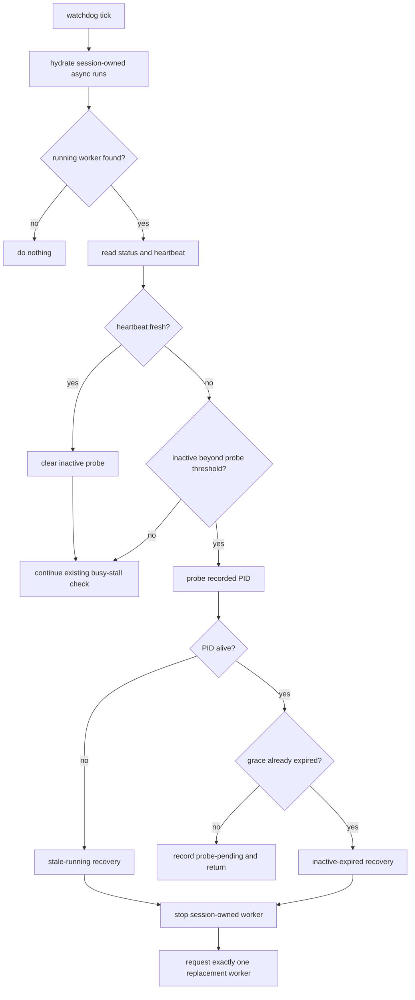

# add: Probe inactive Goal-Driven workers before recovery

## Overview

Add a lightweight heartbeat probe phase to the existing Goal-Driven master watchdog so inactive worker subagents are inspected before recovery. The recommended architecture keeps supervision inside the current master-side watchdog in `index.ts`; it does not introduce a separate background monitor subagent.

The new behavior should distinguish three cases:

1. **Worker resumed activity** — clear the probe state and leave the worker alone.
2. **Worker process is stale/dead** — stop or mark the session-owned run and request exactly one replacement worker.
3. **Worker process is alive but remains silent through a short grace window** — stop it and request exactly one replacement worker with timeout guidance.

---

## Problem Frame

`pi-goal-driven` already supervises async workers launched through `pi-subagents`. The current watchdog can stop workers that remain inactive for a long interval, and the busy-stall detector handles repetitive low-progress activity. The remaining gap is the ambiguous middle state: a worker can be marked `running` while producing no observable activity, but it may be either legitimately quiet, stuck in a long command, or stale because its recorded process is gone.

A heartbeat probe phase makes this recovery more precise without adding another agent/process to supervise.

---

## Requirements Trace

- R1. Keep Goal-Driven worker lifecycle decisions session-scoped to the active Goal-Driven run.
- R2. Detect stale `running` async state when the recorded worker PID no longer exists.
- R3. Probe inactive workers before stopping them, giving live-but-silent workers a bounded grace window.
- R4. If a worker resumes activity during the grace window, clear probe state and avoid replacement.
- R5. If a worker remains inactive after the grace window, stop only the session-owned worker and request exactly one replacement.
- R6. Preserve the single active worker invariant; do not launch a monitor subagent.
- R7. Make the status/last-event text explain whether the worker is probe-pending, stale-running, or inactive-expired.
- R8. Cover probe classification and watchdog integration with deterministic tests.

---

## Scope Boundaries

- Do not add a background monitor subagent in v1.
- Do not add a daemon, queue, database, or persistent monitor service.
- Do not modify `pi-subagents` internals for this change.
- Do not attempt semantic progress detection from model text.
- Do not send interactive prompts into the worker process as the heartbeat mechanism.

### Deferred to Follow-Up Work

- Upstream `pi-subagents` improvement: expose native stale-running or dead-PID status for all async users.
- Optional intercom-based worker nudge: only if a reliable child message route already exists and does not complicate the single-worker invariant.

---

## Context & Research

### Relevant Code and Patterns

- `index.ts` defines the current Goal-Driven runtime, active run state, async worker tracking, watchdog interval, inactivity stop behavior, and busy-stall detection.
- `index.ts` already reads async run artifacts through helpers such as `readAsyncRunSnapshot`, `readPathMtime`, `getAsyncRunHeartbeatAt`, `inspectAsyncRunForBusyStall`, and `classifyBusyStall`.
- `index.ts` already routes recovery through `stopKnownAsyncRuns` and `sendGoalDrivenFollowUp`, which should remain the stop/replacement path.
- `index.test.ts` already has deterministic tests around worker task guards, session-scoped async ownership, scoped status formatting, busy-stall inspection, and busy-stall follow-up wording.
- `README.md` documents current async worker behavior and should be updated only if the user-visible watchdog behavior changes enough to warrant release-note-level clarity.

### Institutional Learnings

- No `docs/solutions/` directory was found in this repository during planning, so there are no local institutional learning docs to incorporate.

### External References

- No external research is needed. This is a local runtime supervision change built on existing `pi-goal-driven` and `pi-subagents` artifact patterns.

---

## Key Technical Decisions

- **Use the master-side watchdog, not a background monitor subagent:** The master already owns Goal-Driven run state, session scoping, replacement prompts, and cleanup. A monitor subagent would introduce another async lifecycle and reporting channel for little benefit.
- **Use async artifacts plus PID liveness as the heartbeat probe source:** `status.json`, `events.jsonl`, output log mtimes, and the recorded PID are sufficient for a conservative first version.
- **Probe before stopping:** The first inactive observation should record a pending probe and grace deadline, not immediately kill a live worker.
- **Treat dead PID as stale-running:** If status says `running` but the recorded PID no longer exists, the run should be recovered without waiting for the grace window.
- **Keep probe state in memory:** The active watchdog can recompute from async artifacts after restart; no persistent database is needed for v1.
- **Reuse existing stop/replacement paths:** Recovery should continue through `stopKnownAsyncRuns` and `sendGoalDrivenFollowUp` so ownership scoping and master behavior stay consistent.

---

## Open Questions

### Resolved During Planning

- **Should monitoring be done by master or a background subagent?** Use the master-side watchdog. It is simpler, already session-scoped, and avoids supervising a second subagent.
- **Should this change modify `pi-subagents`?** Not in v1. Goal-Driven can consume the existing async run artifacts and own its recovery decision.
- **Should inactive workers be stopped immediately?** No. Probe first, then give a short grace window unless the PID is already gone.

### Deferred to Implementation

- **Exact thresholds:** Start with conservative constants and adjust if tests or real runs show false positives.
- **Exact test seam for PID liveness:** Implementation should choose the smallest testable shape, likely by parameterizing the PID checker in helper-level tests.
- **Whether to append a custom diagnostic entry for stale-running:** Useful but optional; status text and replacement prompt may be enough for v1.

---

## High-Level Technical Design

> *This illustrates the intended approach and is directional guidance for review, not implementation specification. The implementing agent should treat it as context, not code to reproduce.*

---

## Implementation Units

- [x] U1. **Add heartbeat probe primitives**

**Goal:** Add the small helper surface needed to classify inactive async runs as active, probe-pending, stale-running, inactive-expired, or unknown.

**Requirements:** R2, R3, R4, R8

**Dependencies:** None

**Files:**
- Modify: `index.ts`
- Test: `index.test.ts`

**Approach:**
- Add a PID liveness helper using the platform process table in the smallest portable way available in Node.
- Add a probe classifier that consumes current async snapshot data, latest heartbeat timestamp, existing pending probe state, current time, and PID liveness.
- Keep the classifier independent enough to test without launching real workers.
- Use existing heartbeat sources: status `lastUpdate`, `events.jsonl` mtime, and current output log mtime.
- Return plain classifications and reason text rather than triggering side effects inside the helper.

**Patterns to follow:**
- `readAsyncRunSnapshot` and `getAsyncRunHeartbeatAt` for defensive async artifact reads.
- `classifyBusyStall` for deriving a small runtime classification from inspection data.
- Existing `node:test` assertions in `index.test.ts`.

**Test scenarios:**
- Happy path: running status with live PID and stale heartbeat returns probe-pending before grace expiry.
- Happy path: running status with live PID and stale heartbeat returns inactive-expired after grace expiry.
- Edge case: running status with dead/missing PID returns stale-running.
- Edge case: fresh heartbeat returns active and provides enough signal for the caller to clear prior probe state.
- Error path: missing or insufficient heartbeat data returns unknown rather than throwing.

**Verification:**
- The helper can be exercised deterministically with fake timestamps and fake PID liveness results.

---

- [x] U2. **Integrate probe state into the watchdog loop**

**Goal:** Make `watchdogTick` probe inactive workers before stopping them, while preserving current quiet-inactivity and busy-stall recovery behavior.

**Requirements:** R1, R3, R4, R5, R6, R8

**Dependencies:** U1

**Files:**
- Modify: `index.ts`
- Test: `index.test.ts`

**Approach:**
- Add a small `inactiveProbe` field to `ActiveRun`.
- Clear probe state when the active async worker changes, when the worker is no longer active, or when heartbeat becomes fresh.
- On first inactivity beyond the probe threshold, store probe-pending state and return without stopping the worker.
- On later ticks for the same worker, stop only if the probe reports stale-running or inactive-expired.
- Reuse `stopKnownAsyncRuns` for the stop path and `sendGoalDrivenFollowUp` for the replacement instruction.
- Keep busy-stall detection after the heartbeat freshness/probe path so the two detectors do not fight each other.

**Patterns to follow:**
- Existing `watchdogTick` structure around `findRunningKnownAsyncRun`, `readAsyncRunSnapshot`, `getAsyncRunHeartbeatAt`, `stopKnownAsyncRuns`, and `sendGoalDrivenFollowUp`.
- Existing recovery fields on `ActiveRun`, such as `activeAsyncId`, `activeAsyncDir`, `latestAsyncId`, `latestAsyncDir`, and `lastEvent`.

**Test scenarios:**
- Happy path: first inactive watchdog tick records a pending probe and does not call the stop path.
- Happy path: the same worker remains inactive past grace, so the watchdog stops it and sends exactly one replacement instruction.
- Edge case: activity resumes during grace, so probe state clears and no replacement is requested.
- Edge case: active async ID changes while a probe is pending, so the old probe is ignored/cleared.
- Error path: status changes to complete/failed before stop, so the watchdog does not attempt stale recovery.

**Verification:**
- Existing busy-stall tests continue to pass.
- Existing inactive worker recovery semantics remain session-scoped.

---

- [x] U3. **Add concise status, diagnostics, and docs**

**Goal:** Make probe outcomes understandable to the master and user without adding new UI surfaces or complexity.

**Requirements:** R5, R7, R8

**Dependencies:** U2

**Files:**
- Modify: `index.ts`
- Modify: `README.md`
- Test: `index.test.ts`

**Approach:**
- Update `run.lastEvent` for probe-pending, stale-running, and inactive-expired outcomes.
- Keep replacement instructions narrow: mention the probe outcome and tell the replacement worker to inspect prior evidence and avoid silent long-running commands without timeouts.
- Optionally append a small custom session entry for stale-running recovery if implementation needs durable diagnostics, but avoid duplicating the larger busy-stall diagnostic structure unless it proves useful.
- Update `README.md` only with user-visible behavior: inactive workers are probed, stale runs are recovered, and replacement remains session-scoped.

**Patterns to follow:**
- Existing watchdog notification copy in `index.ts`.
- Existing busy-stall replacement instruction style.
- Existing README bullets under `/goal-driven:work` runtime behavior.

**Test scenarios:**
- Happy path: probe-pending last-event text includes the worker ID and grace/pending wording.
- Happy path: stale-running replacement instruction mentions the dead/missing PID condition.
- Happy path: inactive-expired replacement instruction mentions heartbeat grace expiry and timeout guidance.
- Edge case: README/status wording does not imply unrelated async runs are affected.

**Verification:**
- Status output clearly distinguishes probe-pending, stale-running, and inactive-expired recovery.
- Documentation matches the implemented session-scoped behavior.

---

## System-Wide Impact

- **Interaction graph:** `/goal-driven:work` starts the active run, `subagent` launches the worker, `pi-subagents` writes async artifacts, and the Goal-Driven watchdog reads those artifacts to decide whether to wait, probe, stop, or replace.
- **Error propagation:** Probe failures should degrade to the existing conservative behavior instead of crashing the extension or killing unrelated workers.
- **State lifecycle risks:** Pending probe state must be cleared when worker identity changes or heartbeat resumes, or the next worker could inherit stale probe state.
- **API surface parity:** No public command shape changes are planned. The existing `/goal-driven stop` and session-scoped `subagent_status list` behavior should remain compatible.
- **Integration coverage:** Unit tests should cover helper classification and watchdog branch behavior; full runtime validation remains a manual/interactive behavior check after implementation.
- **Unchanged invariants:** Only one Goal-Driven worker subagent should be active for the current session tree, and unrelated async subagents must remain untouched.

---

## Risks & Dependencies

| Risk | Mitigation |
|------|------------|
| False positive on legitimate silent work | Probe first, use a grace window, and keep thresholds conservative. |
| PID reuse makes a dead worker look alive | Accept for KISS v1; use heartbeat grace so liveness alone does not prove progress. |
| Race with worker completion | Re-read status before stopping and no-op if the run is no longer active. |
| Probe state leaks across workers | Store the async ID with the probe and clear it on worker ID changes. |
| Added complexity overlaps with busy-stall detection | Keep heartbeat probe focused only on no-activity/stale-PID cases; leave repetitive-output loops to existing busy-stall logic. |

---

## Documentation / Operational Notes

- Update `README.md` only if implementation changes the user-visible watchdog bullet list.
- No migration or rollout mechanism is needed.
- Verification should include the TypeScript typecheck and existing test suite after implementation.

---

## Sources & References

- Related code: `index.ts`
- Related tests: `index.test.ts`
- Related docs: `README.md`
- Prior related plan: `docs/plans/2026-04-24-001-fix-async-worker-stall-recovery-plan.md`
